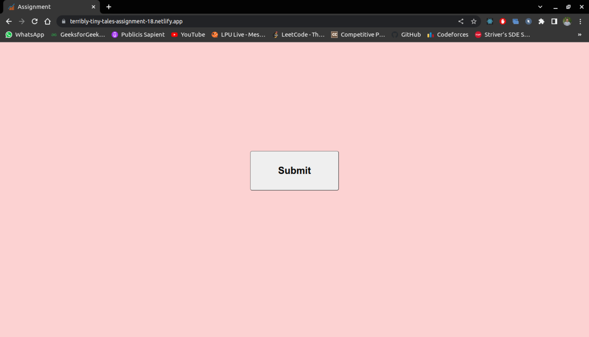
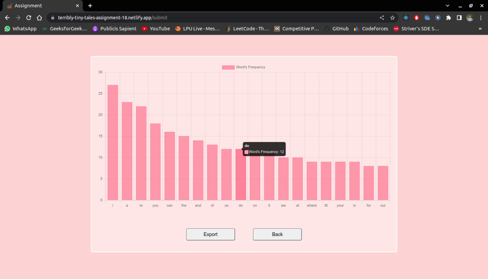
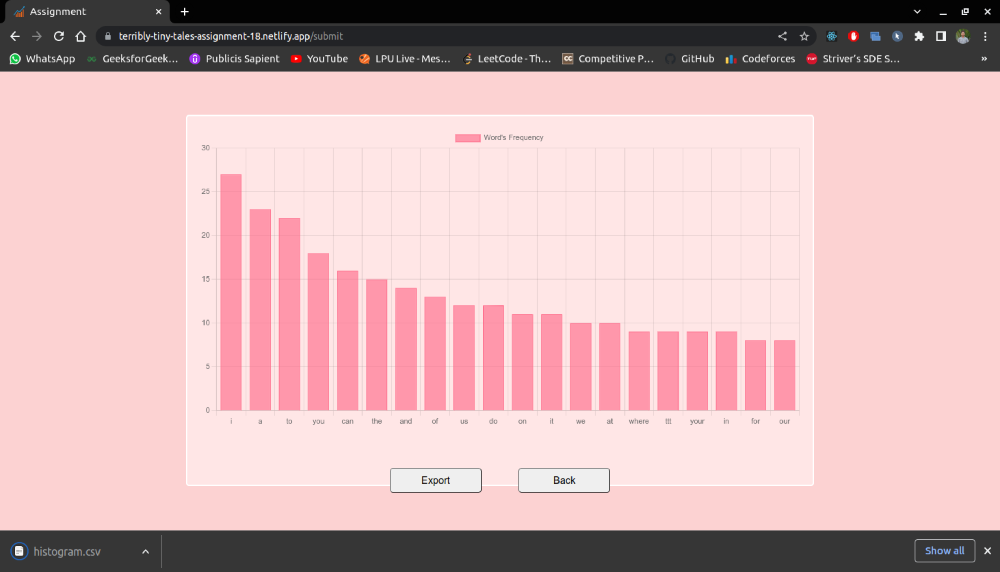

# Task 
Develop a frontend in Reactjs or Nextjs, which does the following:

1. On first load, only has a Submit button
2. On clicking on Submit, it will fetch the contents of https://www.terriblytinytales.com/test.txt
3. Parse the content and find the frequency of occurrence of each word (some words will occur only once, some twice and so  on, and some will occur N times)
4. Then on the frontend, plot a histogram of the 20 most occurring words.

Also build an "Export" button, which when clicked will download a CSV file of the histogram data.
X-axis = top 20 words with highest occurrence Y-axis = how many times they occurred in the file

# Installation

* Clone the repository.
``` 
 $ git clone https://github.com/Anuj-Gupta79/-TERRIBLY-TINY-TALES.git
``` 

* Navigate to the project directory.
``` 
 $ cd -TERRIBLY-TINY-TALES
```

* Install dependencies
```
 $ npm install
```

* Start the application
```
 $ npm start
```

# Usage

* Open your browser and go to http://localhost:3000.
* On the landing page, you see a "Submit" button.
* Click the "Submit" button to fetch the contents from https://www.terriblytinytales.com/test.txt.
* The application will parse the content and generate a histogram chart displaying the 20 most occurring words.
* You can click on the "Export" button to download a CSV file containing the histogram data.
* The X-axis of the histogram represents the top 20 words with the highest occurrence, and the Y-axis represents the frequency of their occurrence in the text file.
* You can also return back to landing page by clicking the back button.


# Explaination
## 1.SubmitButtonComponent

* useState: The useState hook is used to manage the component's state. In this code, it is used to track the loading state (isLoading). The initial value of isLoading is set to false, and the setIsLoading function is used to update its value.

* useNavigate: The useNavigate hook is imported from the react-router-dom library. It provides a function (navigate) that allows for programmatic navigation to different routes.

* navigate: The navigate function returned by the useNavigate hook is stored in the navigate constant. It will be used to navigate to the "/submit" route when the button is clicked.

* loadHandle: The loadHandle function is triggered when the button is clicked. It toggles the isLoading state using the setIsLoading function, and then calls the navigate function to navigate to the "/submit" route.

* Button JSX: The component returns JSX code that renders a button with a "Submit" heading. The button's onClick event is set to the loadHandle function. It also includes inline styling to define the margin, padding, width, border radius, and cursor of the button.


## 2. Histogram
### 1. Variables:
 * words: A state variable managed by the useState hook to store an array of words.
 * histogramData: A state variable managed by the useState hook to store the data for the histogram.
 * navigate: The useNavigate hook from react-router-dom to handle navigation within the application.

### 2. handleGoBack Function:
 * A function that uses the navigate function to navigate back to the home page ("/") when the "Back" button is clicked.

### 3. useEffect Hook:
 * The useEffect hook is used to fetch the text data from "https://www.terriblytinytales.com/test.txt" and process it.
 * It cleans the text by removing punctuation and converting it to lowercase.
 * It splits the text into an array of words and calculates the frequency of each word.
 * It sorts the words based on frequency and selects the top 20 words.
 * It constructs the data object for the histogram using the sorted words and their frequencies.
 * updates the histogramData state variable and sets the words state variable with the sorted words.

### 4. handleExport Function:
 * A function triggered when the "Export" button is clicked.
 * It generates a CSV file containing the histogram data.
 * The CSV data is created by mapping the labels and data of the histogramData object.
 * The CSV file is downloaded by creating a Blob object and creating a temporary link element.

### 5. return Function:
 * The component returns JSX code that renders the histogram using the Bar component from react-chartjs-2 if histogramData is not null.
 * The histogram is wrapped in a div element with custom styling.
 * Below the histogram, there are two buttons: "Export" and "Back".
 * The "Export" button triggers the handleExport function when clicked.
 * The "Back" button triggers the handleGoBack function when clicked.
 * The buttons have custom styling for appearance and interactivity.
 
 # Plugins And Libraries
 1. React: A JavaScript library for building user interfaces.
 2. react-router-dom: A library that provides routing capabilities for React applications.
 3. react-chartjs-2: A library for creating charts in React using Chart.js.
 4. chart.js/auto: A plugin that automatically installs the required Chart.js components based on the chart type used.
 


# Link of the project (Deploy on Netlify)

### https://terribly-tiny-tales-assignment-18.netlify.app/

# Screenshots
### 1. Landing Page 

 
 
### 2. Histogram Chart with max count of word.

 
 
### 3. CSV file download.

 
